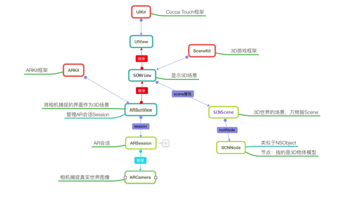
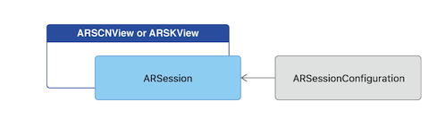
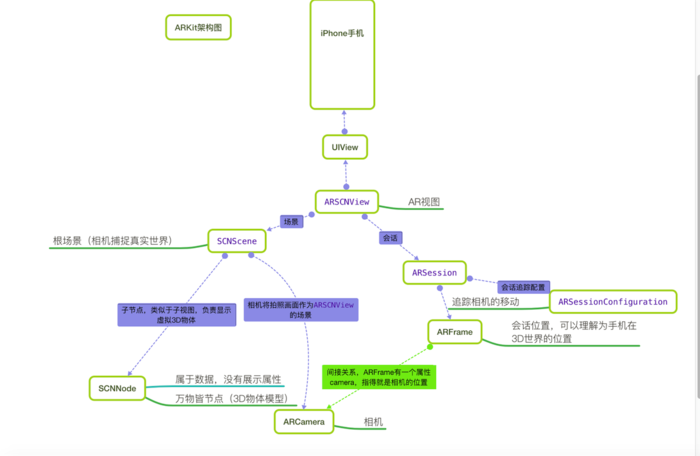
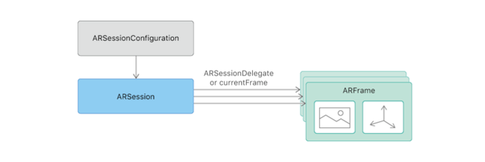
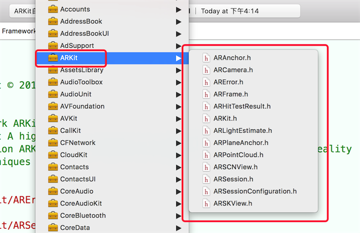
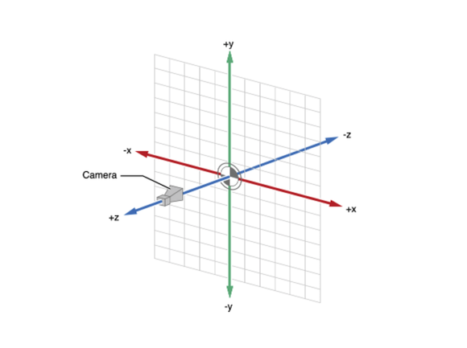
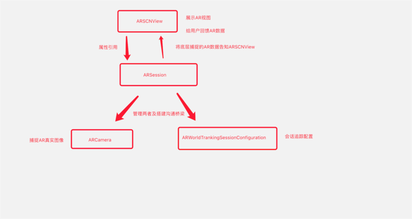

#AR技术分享

##前言
六一快乐
***
### ARKit分享目录
###### 一、AR技术简介
###### 二、``ARKit``概述及特点介绍
###### 三、``ARKit``初体验之“HellowWorld”
###### 四、``ARKit``与``SceneKit``的关系
###### 五、``ARKit``工作原理
###### 六、``ARKit``部分API翻译
###### 七、写一个入门级程序 帮助理解(AR彩蛋)
###### 八、总结和讨论
***
#### 一、AR技术简介
* 增强现实技术（Augmented Reality，简称AR），是一种实时地计算摄像机影像位置及角度并加上相应图像、视频、3D模型的技术，这种技术的目标是**在屏幕上把虚拟世界套在现实世界并进行互动**
* AR场景实现所需要的技术以及步骤如下：
  
 * 1、多媒体捕捉现实图像：如摄像头(关于传感器在AR中的使用畅想)
 * 2、三维建模：3D立体模型
 * 3、传感器追踪：追踪现实世界动态物体的六轴变化，这六轴分别是X、Y、Z轴位移及旋转。位移三轴决定物体的方位和大小，旋转三轴决定物体显示的区域角度 
 * 4、坐标识别及转换：3D模型显示在现实图像中不是单纯的frame坐标点，而是一个三位的矩阵坐标。这基本上也是学习AR最难的部分，好在``ARKit``帮助我们大大简化了这一过程。
 
步骤: 摄像头-(x,y,z)->模型->模型自身(w,h,L,Sx,Sy,Sz)（没必要花时间理解，后面会带着一起理解）

#### 二、``ARKit``概述及特点介绍
* 1、``ARKit``是2017年6月6日，苹果发布iOS11系统所新增框架，它能够帮助我们以最简单快捷的方式实现AR技术功能。
* 2、``ARKit``框架提供了两种AR技术，一种是基于3D场景(``SceneKit``)实现的增强现实，一种是基于2D场景(``spriteKit``)实现的增强现实
	* 一般主流都是基于3D实现AR技术，**``ARKit``不仅支持3D游戏引擎``SceneKit``还支持2D游戏引擎``SpriteKit``**
* 3、要显示AR效果，必须要依赖于苹果的游戏引擎框架(3D游戏引擎``SceneKit``、2D游戏引擎``SpriteKit``)，主要原因是游戏引擎才可以加载物体模型。
   * ``ARKit``框架中视图对象ARSCNView间接继承于UIView，但是**由于目前``ARKit``框架本身只包含相机追踪，不能直接加载物体模型，所以只能依赖于游戏引擎加载``ARKit``**
* 4、开发硬件要求：
   * 不仅要求iOS11的系统、而且A9处理器才可以使用``ARKit``。也就是说**6s以上&iOS11系统以上才可以使用ARKit**，6以前的设备不是A9芯片
   * xcode(9.0)+ iOS(11)+ iPhone6s(A9)+ macOS(10.12.4)+
   
#### 三、``ARKit``初体验之“HellowWorld”
* 上前戏--2D增强现实(2D游戏引擎``SpriteKit``)
* 主流来了--3D增强现实(3D游戏引擎``SceneKit``)

**帮老铁在项目中理解：摄像头-(x,y,z)->模型->模型自身(w,h,L,Sx,Sy,Sz)**

#### 四、``ARKit``与``SceneKit``的关系
* 1、在前三部分介绍过，AR技术叫做虚拟增强现实，也就是在相机捕捉到的现实世界的图像中显示一个虚拟的3D模型。这一过程可以分为两步：
 * <1、相机捕捉现实世界图像
     * 由``ARKit``来实现
 * <2、在图像中显示虚拟3D模型
     * 由``SceneKit``来实现
* 2、ARSCNView只是一个视图容器，它的作用是管理一个ARSession，称之为AR会话
* 3、在一个完整的虚拟增强现实体验中，``ARKit``框架只负责将真实世界画面转变为一个3D场景，这一个转变的过程主要分为两个环节：**由ARCamera负责捕捉摄像头画面，由ARSession负责搭建3D场景**
* 4、在一个完整的虚拟增强现实体验中，将虚拟物体实现在3D场景中是由``SceneKit``框架来完成：**每一个虚拟的物体都是一个节点SCNNode，每一个节点构成了一个场景SCNScene，无数个场景构成了3D世界**
* 5、**综上所述，``ARKit``捕捉3D现实世界使用的是自身的功能，这个功能是在iOS11新增的。而ARKit在3D现实场景中添加虚拟物体使用的是父类SCNView的功能，这个功能早在iOS8时就已经添加(SceneKit是iOS8新增)**
  * 下面在介绍使用ARScnView不再重复这一关系，可以简单理解为：ARSCNView所有跟场景和虚拟物体相关的属性及方法都是自己父类SCNView的
  
  
#### 五、``ARKit``工作原理
##### 1、ARSCNView与ARSession
* 1.1、无论``ARKit``是用3D的ARSCNView和2D的ARSKView，都是用了相机视图作为背景视图，而这一个相机的图像就是由``ARKit``框架中的相机类ARCamera来捕捉的。
* 1.2、ARSCNView与ARCamera两者之间并没有直接的关系，它们之间是通过AR会话（``ARKit``中非常重量级的一个类ARSession）来搭建沟通桥梁的
  * **在iOS框架中，凡是带session或者context后缀的，这种类一般自己不干活，作用一般都是两个：1.管理其他类，帮助他们搭建沟通桥梁，好处就是解耦 2.负责帮助我们管理复杂环境下的内存**
     * context与session不同之处是：一般与硬件打交道，例如摄像头捕捉ARSession，网卡的调用NSURLSession等使用的都是session后缀。没有硬件参与，一般用context，如绘图上下文，自定义转场上下文等
* 1.3、想要运行一个ARSession会话，必须要指定一个称之为“会话追踪配置”的对象：ARSessionConfiguration，ARSessionConfiguration的主要目的就是负责追踪相机在3D世界中的位置以及一些特征场景的捕捉（例如平面捕捉），这个类本身比较简单却作用巨大
 * ARSessionConfiguration是一个父类，为了更好的看到增强现实的效果，苹果官方建议我们使用它的子类ARWorldTrackingSessionConfiguration,该类只支持A9芯片之后的机型（6s+）
 

##### 2、ARWorldTrackingSessionConfiguration与ARFrame
* 2.1、ARSession搭建沟通桥梁的参与者主要有两个ARWorldTrackingSessionConfiguration与ARFrame
* 2.2、ARWorldTrackingSessionConfiguration（会话追踪配置）的作用是跟踪设备的方向和位置,以及检测设备摄像头看到的现实世界的表面。它的内部实现了一系列非常庞大的算法计算以及调用了你的iPhone必要的传感器来检测手机的移动及旋转甚至是翻滚
 * 我们无需关心内部实现，``ARKit``框架帮助我们封装的非常完美，只需调用一两个属性即可
* 2.3、当ARWorldTrackingSessionConfiguration计算出相机在3D世界中的位置时，它本身并不持有这个位置数据，而是将其计算出的位置数据交给ARSession去管理（与前面说的session管理内存相呼应），而相机的位置数据对应的类就是ARFrame
 * ARSession类一个属性叫做currentFrame，维护的就是ARFrame这个对象
* ARCamera只负责捕捉图像，不参与数据的处理。它属于3D场景中的一个环节，每一个3D Scene都会有一个Camera，它觉得了我们看物体的视野

##### 3、ARKit工作完整流程
* ARKit框架工作流程可以参考下图:
 * 3.1、ARSCNView加载场景SCNScene
 * 3.2、SCNScene启动相机ARCamera开始捕捉场景
 * 3.3、捕捉场景后ARSCNView开始将场景数据交给Session
 * 3.4、Session通过管理ARSessionConfiguration实现场景的追踪并且返回一个ARFrame
 * 3.5、给ARSCNView的scene添加一个子节点（3D物体模型)



它们三者之间的关系看起来如下图：


#### 六、``ARKit``部分API翻译
* 先看一下系统``FrameWork``中的``ARKit``框架类图
  
* ARAnchor 
 * 表示一个物体在3D空间的位置和方向（ARAnchor通常称为物体的3D锚点，有点像UIKit框架中CALayer的Anchor）
 * ARFrame表示的也是物体的位置和方向，但是ARFrame通常表示的是AR相机的位置和方向以及追踪相机的时间，还可以捕捉相机的帧图片
 * 也就是说**ARFrame用于捕捉相机的移动，其他虚拟物体用ARAnchor**
 
 ```
 @interface ARAnchor : NSObject <NSCopying>

 /**
  标识符
  */
 @property (nonatomic, readonly) NSUUID *identifier;

 /**
  锚点的旋转变换矩阵，定义了锚点的旋转、位置、缩放。是一个4x4的矩阵（读者可以自行科普什么叫4x4矩阵）
  */
 @property (nonatomic, readonly) matrix_float4x4 transform;

 /**
  构造方法,一般我们无需构造。因为添加一个3D物体时ARKit会有代理告知我们物体的锚点
  */
 - (instancetype)initWithTransform:(matrix_float4x4)transform;

 @end

 ```

* ARCamera
  
 * ARCamera是一个相机，它是连接虚拟场景与现实场景之间的枢纽。在ARKit中，它是捕捉现实图像的相机，在SceneKit中它又是3D虚拟世界中的相机。（一般第一人称3D游戏，主角其实就是一个3D相机，我们电脑屏幕看到的画面就是这个相机捕捉的画面）
     * 一般我们无需去创建一个相机，因为当我们初始化一个AR试图时，他会为我们默认创建一个相机，而且这个相机就是摄像头的位置，同时也是3D世界中的原点所在（x=0,y=0,z=0）
     * ARCamera的API一般我们无需关心，因为ARKit会默认帮助我们配置好

```
@interface ARCamera : NSObject <NSCopying>

/**
 4x4矩阵表示相机位置，同ARAnchor
 */
@property (nonatomic, readonly) matrix_float4x4 transform;

/**
相机方向（旋转）的矢量欧拉角
分别是x/y/z
 */
@property (nonatomic, readonly) vector_float3 eulerAngles;

/**
 相机追踪状态（在下方会有枚举值介绍）
 */
@property (nonatomic, readonly) ARTrackingState trackingState NS_REFINED_FOR_SWIFT;

/**
追踪运动类型
 */
@property (nonatomic, readonly) ARTrackingStateReason trackingStateReason NS_REFINED_FOR_SWIFT;

/**
相机曲率（笔者有点费解，反复揣摩应该是与焦距相关参数）
3x3矩阵
 fx 0   px
 0  fy  py
 0  0   1
 */
@property (nonatomic, readonly) matrix_float3x3 intrinsics;

/**
摄像头分辨率
 */
@property (nonatomic, readonly) CGSize imageResolution;

/**
投影矩阵
*/
@property (nonatomic, readonly) matrix_float4x4 projectionMatrix;

/**
创建相机投影矩阵
 */
- (matrix_float4x4)projectionMatrixWithViewportSize:(CGSize)viewportSize orientation:(UIInterfaceOrientation)orientation zNear:(CGFloat)zNear zFar:(CGFloat)zFar;

@end

//相机追踪状态枚举
typedef NS_ENUM(NSInteger, ARTrackingState) {
    
    /** 不被允许 */
    ARTrackingStateNotAvailable,
    
    /** 最小 */
    ARTrackingStateLimited,
    
    /** 正常. */
    ARTrackingStateNormal,
} NS_REFINED_FOR_SWIFT;

/**
 追踪运动类型
 */
API_AVAILABLE(ios(11.0)) API_UNAVAILABLE(macos, watchos, tvos)
typedef NS_ENUM(NSInteger, ARTrackingStateReason) {
    /** 无. */
    ARTrackingStateReasonNone,
    
    /** 运动. */
    ARTrackingStateReasonExcessiveMotion,
    
    /** 脸部捕捉. */
    ARTrackingStateReasonInsufficientFeatures,
} NS_REFINED_FOR_SWIFT;
```
     
 
* ARError
 * ARError是一个描述ARKit错误的类，这个错误来源于几个方面，例如设备不支持，或者当相机常驻后台时ARSession会断开等问题
 
```
//作用域，一般会表示是哪一个类出现问题
NSString *const ARErrorDomain;

//错误码描述  100：不支持会话追踪配置，主线由于A9芯片以下的机型会报错   101：失活状态 102：传感器故障  200：追踪失败
typedef NS_ERROR_ENUM(ARErrorDomain, ARErrorCode) {
    /** Unsupported session configuration. */
    ARErrorCodeUnsupportedConfiguration   = 100,

    /** A sensor required to run the session is not available. */
    ARErrorCodeSensorUnavailable          = 101,

    /** A sensor failed to provide the required input. */
    ARErrorCodeSensorFailed               = 102,

    /** World tracking has encountered a fatal error. */
    ARErrorCodeWorldTrackingFailed        = 200,
};
```
* ARFrame 
 * ARFrame主要是追踪相机当前的状态，这个状态不仅仅只是位置，还有图像帧及时间等参数

```
 @interface ARFrame : NSObject <NSCopying>

/**
时间戳.
 */
@property (nonatomic, readonly) NSTimeInterval timestamp;

/**
 缓冲区图像帧
 */
@property (nonatomic, readonly) CVPixelBufferRef capturedImage;

/**
相机（表示这个ARFrame是哪一个相机的，iPhone7plus有两个摄像机）
 */
@property (nonatomic, copy, readonly) ARCamera *camera;

/**
 返回当前相机捕捉到的锚点数据（当一个3D虚拟模型加入到ARKit中时，锚点值得就是这个模型在AR中的位置）
 */
@property (nonatomic, copy, readonly) NSArray<ARAnchor *> *anchors;

/**
灯光，详情可见本章节ARLightEstimate类介绍（指的是灯光强度 一般是0-2000，系统默认1000）
 */
@property (nonatomic, copy, nullable, readonly) ARLightEstimate *lightEstimate;

/**
特征点（应该是捕捉平地或者人脸的，比较苹果有自带的人脸识别功能）
 */
@property (nonatomic, nullable, readonly) ARPointCloud *rawFeaturePoints;

/**
根据2D坐标点搜索3D模型，这个方法通常用于，当我们在手机屏幕点击某一个点的时候，可以捕捉到这一个点所在的3D模型的位置，至于为什么是一个数组非常好理解。手机屏幕一个是长方形，这是一个二维空间。而相机捕捉到的是一个由这个二维空间射出去的长方体，我们点击屏幕一个点可以理解为在这个长方体的边缘射出一条线，这一条线上可能会有多个3D物体模型
point：2D坐标点（手机屏幕某一点）
ARHitTestResultType：捕捉类型  点还是面
(NSArray<ARHitTestResult *> *)：追踪结果数组  详情见本章节ARHitTestResult类介绍

 */
- (NSArray<ARHitTestResult *> *)hitTest:(CGPoint)point types:(ARHitTestResultType)types;

/**
相机窗口的的坐标变换（可用于相机横竖屏的旋转适配）
 */
- (CGAffineTransform)displayTransformWithViewportSize:(CGSize)viewportSize orientation:(UIInterfaceOrientation)orientation;

@end
```
* ARHitTestResult
 * ARHitTestResult：点击回调结果，这个类主要用于虚拟增强现实技术（AR技术）中现实世界与3D场景中虚拟物体的交互。 比如我们在相机中移动。拖拽3D虚拟物体，都可以通过这个类来获取ARKit所捕捉的结果

```
//捕捉类型枚举
typedef NS_OPTIONS(NSUInteger, ARHitTestResultType) {
    /** 点. */
    ARHitTestResultTypeFeaturePoint              = (1 << 0),

    /** 水平面 y为0. */
    ARHitTestResultTypeEstimatedHorizontalPlane  = (1 << 1),

    /** 已结存在的平面. */
    ARHitTestResultTypeExistingPlane             = (1 << 3),

    /** 已结存在的锚点和平面. */
    ARHitTestResultTypeExistingPlaneUsingExtent  = (1 << 4),
} NS_SWIFT_NAME(ARHitTestResult.ResultType);

/**
捕捉类型
 */
@property (nonatomic, readonly) ARHitTestResultType type;

/**
 3D虚拟物体与相机的距离（单位：米）
 */
@property (nonatomic, readonly) CGFloat distance;

/**
本地坐标矩阵（世界坐标指的是相机为场景原点的坐标，而每一个3D物体自身有一个场景，本地坐标就是相对于这个场景的坐标）类似于frame和bounds的区别
 */
@property (nonatomic, readonly) matrix_float4x4 localTransform;

/**
世界坐标矩阵
 */
@property (nonatomic, readonly) matrix_float4x4 worldTransform;

/**
 锚点（3D虚拟物体，在虚拟世界有一个位置，这个位置参数是SceneKit中的SCNVector3：三维矢量），而锚点anchor是这个物体在AR现实场景中的位置，是一个4x4的矩阵
 */
@property (nonatomic, strong, nullable, readonly) ARAnchor *anchor;

@end
```
* ARLightEstimate
 * ARLightEstimate是一个灯光效果，它可以让你的AR场景看起来更加的好

```
@interface ARLightEstimate : NSObject <NSCopying>

/**
灯光强度  范围0-2000 默认1000
 */
@property (nonatomic, readonly) CGFloat ambientIntensity;

@end
```
* ARPlaneAnchor
 * ARPlaneAnchor是ARAnchor的子类，笔者称之为平地锚点。ARKit能够自动识别平地，并且会默认添加一个锚点到场景中，当然要想看到真实世界中的平地效果，需要我们自己使用SCNNode来渲染这个锚点

```
/**
平地类型，目前只有一个，就是水平面
 */
@property (nonatomic, readonly) ARPlaneAnchorAlignment alignment;

/**
3轴矢量结构体，表示平地的中心点  x/y/z
 */
@property (nonatomic, readonly) vector_float3 center;

/**
3轴矢量结构体，表示平地的大小（宽度和高度）  x/y/z
 */
@property (nonatomic, readonly) vector_float3 extent;

@end
```
* ARPointCloud
 * ARPointCloud：点状渲染云，主要用于渲染场景

```
@interface ARPointCloud : NSObject <NSCopying>

/**
 点的数量
 */
@property (nonatomic, readonly) NSUInteger count;

/**
每一个点的位置的集合（结构体带*表示的是结构体数组）
 */
@property (nonatomic, readonly) const vector_float3 *points;

@end
```
* ARSCNView
 * AR视图，在第一部分介绍过，ARKit支持3D的AR场景和2D的AR场景，ARSCNView是3D的AR场景视图
 * 该类是整个ARKit框架中唯一两个有代理的类其中之一

```
@interface ARSCNView : SCNView

/**
代理
 */
@property (nonatomic, weak, nullable) id<ARSCNViewDelegate> delegate;

/**
AR会话
 */
@property (nonatomic, strong) ARSession *session;

/**
场景
 */
@property(nonatomic, strong) SCNScene *scene;

/**
是否自动适应灯光
 */
@property(nonatomic) BOOL automaticallyUpdatesLighting;

/**
返回对应节点的锚点，节点是一个3D虚拟物体，它的坐标是虚拟场景中的坐标，而锚点ARAnchor是ARKit中现实世界的坐标。
 */
- (nullable ARAnchor *)anchorForNode:(SCNNode *)node;

/**
返回对应锚点的物体
 */
- (nullable SCNNode *)nodeForAnchor:(ARAnchor *)anchor;

/**
根据2D坐标点搜索3D模型，这个方法通常用于，当我们在手机屏幕点击某一个点的时候，可以捕捉到这一个点所在的3D模型的位置，至于为什么是一个数组非常好理解。手机屏幕一个是长方形，这是一个二维空间。而相机捕捉到的是一个由这个二维空间射出去的长方体，我们点击屏幕一个点可以理解为在这个长方体的边缘射出一条线，这一条线上可能会有多个3D物体模型
point：2D坐标点（手机屏幕某一点）
ARHitTestResultType：捕捉类型  点还是面
(NSArray<ARHitTestResult *> *)：追踪结果数组  详情见本章节ARHitTestResult类介绍
数组的结果排序是由近到远
 */
- (NSArray<ARHitTestResult *> *)hitTest:(CGPoint)point types:(ARHitTestResultType)types;

@end

//代理
#pragma mark - ARSCNViewDelegate


//代理的内部实现了SCNSceneRendererDelegate：scenekit代理 和ARSessionObserver：ARSession监听（KVO机制）
@protocol ARSCNViewDelegate <SCNSceneRendererDelegate, ARSessionObserver>
@optional

/**
自定义节点的锚点
 */
- (nullable SCNNode *)renderer:(id <SCNSceneRenderer>)renderer nodeForAnchor:(ARAnchor *)anchor;

/**
当添加节点是会调用，我们可以通过这个代理方法得知我们添加一个虚拟物体到AR场景下的锚点（AR现实世界中的坐标）
 */
- (void)renderer:(id <SCNSceneRenderer>)renderer didAddNode:(SCNNode *)node forAnchor:(ARAnchor *)anchor;

/**
将要刷新节点
 */
- (void)renderer:(id <SCNSceneRenderer>)renderer willUpdateNode:(SCNNode *)node forAnchor:(ARAnchor *)anchor;

/**
 已经刷新节点
 */
- (void)renderer:(id <SCNSceneRenderer>)renderer didUpdateNode:(SCNNode *)node forAnchor:(ARAnchor *)anchor;

/**
 移除节点
 */
- (void)renderer:(id <SCNSceneRenderer>)renderer didRemoveNode:(SCNNode *)node forAnchor:(ARAnchor *)anchor;

@end
```
 
* ARSession
 * AR会话，它的作用已经在前面小节中介绍，这里不再累述     
 * 该类是整个ARKit框架中唯一两个有代理的类其中之一
 * ARSession是一个连接底层与AR视图之间的桥梁，其实ARSCNView内部所有的代理方法都是由ARSession来提供的
 * ARSession与ARScnView之间的关系看起来是这样的:
  
 * ARSession获取相机位置数据主要有两种方式
     * 第一种：push。 实时不断的获取相机位置，由ARSession主动告知用户。通过实现ARSession的代理- (void)session:(ARSession *)session didUpdateFrame:(ARFrame *)frame来获取
     * 第二种：pull。 用户想要时，主动去获取。ARSession的属性currentFrame来获取
  * API介绍
 
```
@interface ARSession : NSObject

/**
 代理
 */
@property (nonatomic, weak) id <ARSessionDelegate> delegate;

/**
指定代理执行的线程（主线程不会有延迟，子线程会有延迟），不指定的话默认主线程
 */
@property (nonatomic, strong, nullable) dispatch_queue_t delegateQueue;

/**
相机当前的位置（是由会话追踪配置计算出来的）
 */
@property (nonatomic, copy, nullable, readonly) ARFrame *currentFrame;

/**
 会话追踪配置
 */
@property (nonatomic, copy, nullable, readonly) ARSessionConfiguration *configuration;

/**
运行会话（这行代码就是开启AR的关键所在）
 */
- (void)runWithConfiguration:(ARSessionConfiguration *)configuration NS_SWIFT_UNAVAILABLE("Use run(_:options:)");

/**
运行会话，只是多了一个参数ARSessionRunOptions：作用就是会话断开重连时的行为。ARSessionRunOptionResetTracking：表示充值追踪  ARSessionRunOptionRemoveExistingAnchors：移除现有锚点
 */
- (void)runWithConfiguration:(ARSessionConfiguration *)configuration options:(ARSessionRunOptions)options NS_SWIFT_NAME(run(_:options:));

/**
暂停会话
 */
- (void)pause;

/**
添加锚点
 */
- (void)addAnchor:(ARAnchor *)anchor NS_SWIFT_NAME(add(anchor:));

/**
移除锚点
 */
- (void)removeAnchor:(ARAnchor *)anchor NS_SWIFT_NAME(remove(anchor:));

@end

//session代理分类两部分，一个是观察者（KVO） 一个是委托者（代理）
#pragma mark - ARSessionObserver


//session KVO观察者
@protocol ARSessionObserver <NSObject>

@optional

/**
 session失败
 */
- (void)session:(ARSession *)session didFailWithError:(NSError *)error;

/**
相机改变追踪状态
 */
- (void)session:(ARSession *)session cameraDidChangeTrackingState:(ARCamera *)camera;

/**
 session意外断开（如果开启ARSession之后，APP退到后台就有可能导致会话断开）
 */
- (void)sessionWasInterrupted:(ARSession *)session;

/**
session会话断开恢复（短时间退到后台再进入APP会自动恢复）
 */
- (void)sessionInterruptionEnded:(ARSession *)session;

@end

#pragma mark - ARSessionDelegate


@protocol ARSessionDelegate <ARSessionObserver>

@optional

/**
 更新相机位置
 */
- (void)session:(ARSession *)session didUpdateFrame:(ARFrame *)frame;

/**
添加锚点
 */
- (void)session:(ARSession *)session didAddAnchors:(NSArray<ARAnchor*>*)anchors;

/**
刷新锚点
 */
- (void)session:(ARSession *)session didUpdateAnchors:(NSArray<ARAnchor*>*)anchors;

/**
移除锚点
 */
- (void)session:(ARSession *)session didRemoveAnchors:(NSArray<ARAnchor*>*)anchors;

@end
```
* ARSessionConfiguration
 * ARSessionConfiguration会话追踪配置，主要就是追踪相机的配置
 * **注意：该类还有一个子类：ARWorldTrackingSessionConfiguration，它们在同一个API文件中**

```
//会话追踪配置类
@interface ARSessionConfiguration : NSObject <NSCopying>

/**
当前设备是否支持，一般A9芯片以下设备不支持
 */
@property(class, nonatomic, readonly) BOOL isSupported;

/**
会话的对其方式，这里的对其指的是3D世界的坐标。枚举值见下方
 */
@property (nonatomic, readwrite) ARWorldAlignment worldAlignment;

/**
是否需要自适应灯光效果，默认是YES
 */
@property (nonatomic, readwrite, getter=isLightEstimationEnabled) BOOL lightEstimationEnabled;

@end


//世界会话追踪配置，苹果建议我们使用这个类，这个子类只有一个属性，也就是可以帮助我们追踪相机捕捉到的平地
@interface ARWorldTrackingSessionConfiguration : ARSessionConfiguration

/**
侦查类型。枚举值见下方（默认侦查平地）
 */
@property (nonatomic, readwrite) ARPlaneDetection planeDetection;

@end
```

```
//追踪对其方式，这个决定了会话的参考坐标系（参照物）
typedef NS_ENUM(NSInteger, ARWorldAlignment) {
/* 相机位置 vector (0, -1, 0) /
ARWorldAlignmentGravity,
/** 相机位置及方向. vector (0, -1, 0)
 heading ：(0, 0, -1) */
ARWorldAlignmentGravityAndHeading,
/** 相机方向. */
ARWorldAlignmentCamera
} NS_SWIFT_NAME(ARSessionConfiguration.WorldAlignment);

/
侦查类型
*/
API_AVAILABLE(ios(11.0)) API_UNAVAILABLE(macos, watchos, tvos)
typedef NS_OPTIONS(NSUInteger, ARPlaneDetection) {
/ 不侦查. */
ARPlaneDetectionNone = 0,
/** 平地侦查 */
ARPlaneDetectionHorizontal  = (1 << 0),
} NS_SWIFT_NAME(ARWorldTrackingSessionConfiguration.PlaneDetection);

```

* ARSKView
 * ARSKView也是AR视图，只不过他是2D的，由于2D比3D简单很多，并且ARSKView基本与ARSCNView类似，所以这里不做重复介绍。详细内容可参考ARSCNView

#### 七、写一个入门级程序 帮助理解(AR在demo中)
#### 八、总结和讨论 


